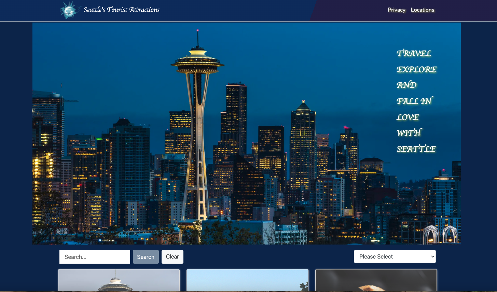
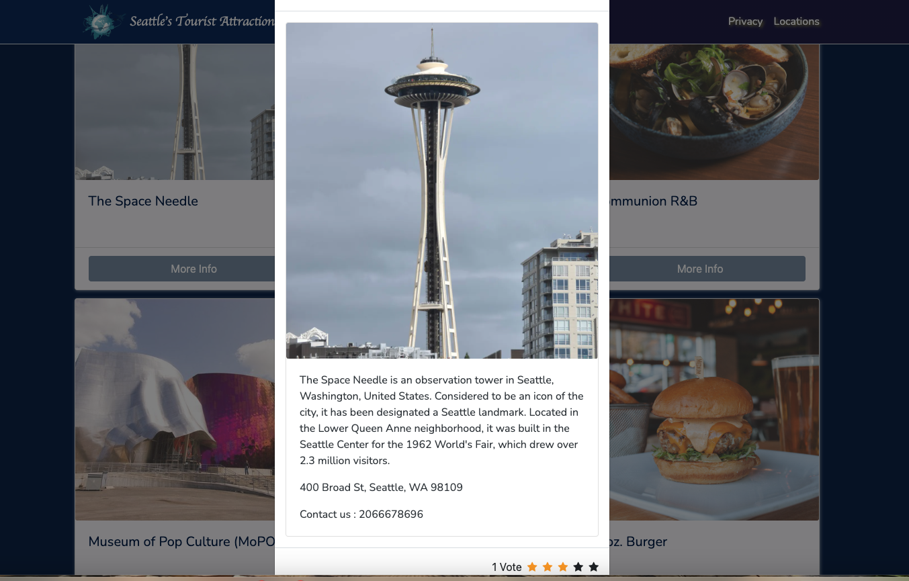
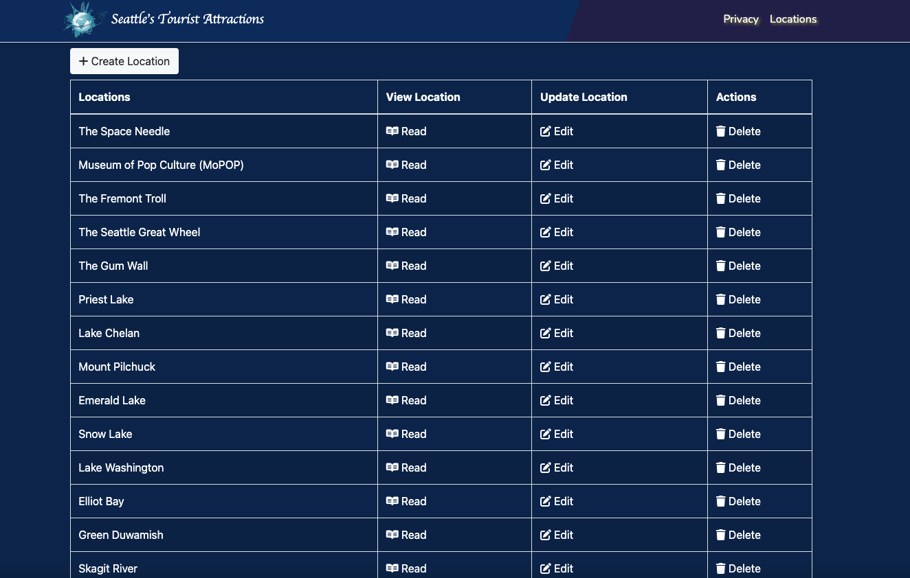
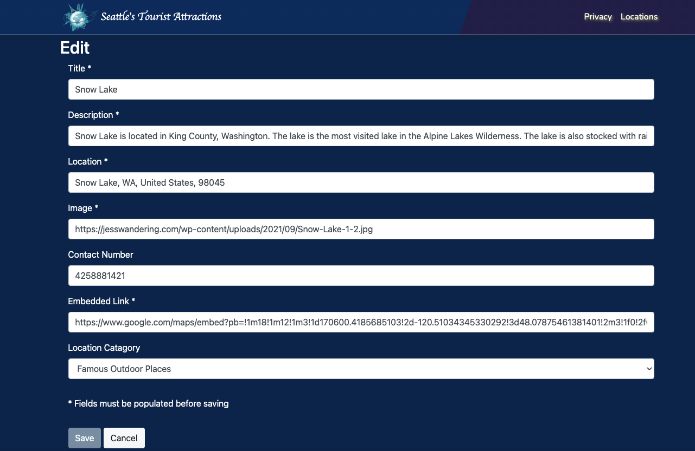

# Seattle Tourist Locations

The go-to website for exploring the renowned attractions in Seattle, ranging from scenic landscapes to popular restaurants and charming teashops. Our platform consolidates extensive location data, empowering visitors to rate, update information, add new locations, and manage location data with ease.

## Screenshots

    
        
On the welcome page, you can view all locations here.

     
    
Once you click the "View" button, the pop-up window will display the location information, and you can rate this place.

    
    
We also provide a list page where users can manage locations easily.

    
    
Once user clicks the "Edit" button, it will display the form that user can edit the location information.

## License

Seattle Tourist Locations is released under the [MIT License](/path/to/license).

